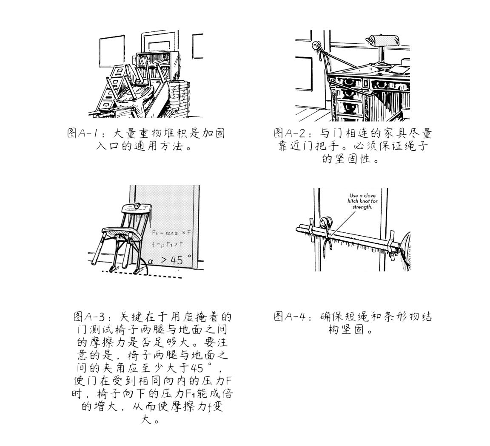

## 1.1.1 对房间入口的加固和简易警铃的安装

第一点措施，是对夜间身处房间或住所入口的加固和简易警铃的安装。对入口结构的改进包括对于门和低层住户中窗户的临时加固。

其中对门进行加固时，可将门分为向外打开和向内打开的两类。考虑到侵害人破门的可能性，向外打开的门需应对向外、向内两种方向的攻破，即同时采取两种措施。

应对向内攻入的威胁有以下几种方法：

1. 可用大量家具或重物（如椅子、橱柜、沙发等）堆积在门内侧，较重的物体集中在门把手处，如图 A-1 所示。

2. 用结实短绳将房间中紧靠门把手的家具（重量较大）和门把手捆绑在一起（原理与旅馆防盗门链相同），如图 A-2 所示。

3. 在房间内部，将椅背高于门把手的椅子向后倾斜，并将椅背顶部紧抵在门把手下方，靠近椅背的两脚紧触地面（使用前需事先用未关紧的门测试此方法，确保地面摩擦力够大），如图A-3 所示。

应对侵害人将门向外拉的情况，可以采取应对向内攻入的第 1、2 种方法（方法 1 中的障碍物堆积可延长侵害人闯入所需的时间）。此外，还可以用结构坚固的扫帚、拖把等条形物横架在左右门框之间。其高度与门把手相近，且两端用胶带固定在房间内的墙面上。用短绳将门把手与条形物捆绑在一起并拉紧，如图 A-4 所示。对窗户的加固可参考上述措施进行修改，应用原理相似。

第二步是设置简易警铃，从而在事发的第一时间作出反应。临时警铃的主要功能是在门把手（此处为条形把手）转动时被触发，发出较大的声音。

通常而言，简易警铃可通过以下方式安装：将坚硬重物用绳索悬挂在条形门把手中间，从而使悬挂重物的绳索在门把手被下压时滑落，让重物撞击地面（地面铺有地毯或软垫时，应提前在重物落点上放置与重物相撞可发出足够声响的物体）。

除此之外，安装的过程中还需考虑延时的因素，即从门把手转动到重物撞击地面的时间间隔。延时可通过改变重物悬挂的高度来调整，且一般不得超过 0.3 秒。

（图片取自 How to Barricade a Door - Patrick Hutchison）
