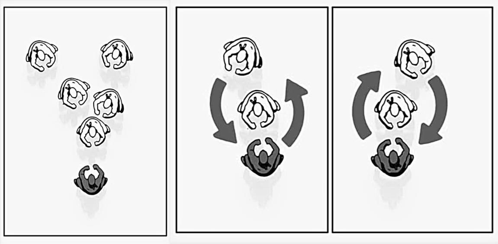

## 2.1.1 站位选择与相对位置控制

本文针对的绝大多数绑架行为由 2~5 人集体实施，因此在事发的第一时间，在有足够反应时间的条件下，最紧迫的问题是处理好与各罪犯之间的相对位置，避免受到围攻。针对此目的的措施如下：

1. 调整自身所处位置，尽量使敌方各人都处于自身的正前方，且处于前面的人与处于后面的人形成遮挡关系。此时直接处于自身正前方的人会将余下大多数人与自身隔离开，如图 B-1 所示。

2. 在采取防卫措施的过程中不断移动脚步，增加变数，使敌方较难控制形势。在条件允许的情况下保持上述相对位置，避免遭受压制和围攻，如图 B-2。

   

   左图为图 B-1。中、右图为 B-2。（图片取自 How to Fight Multiple Assailants - Art of Manliness）
