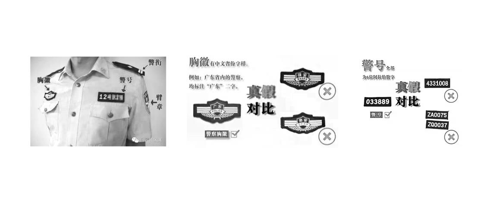
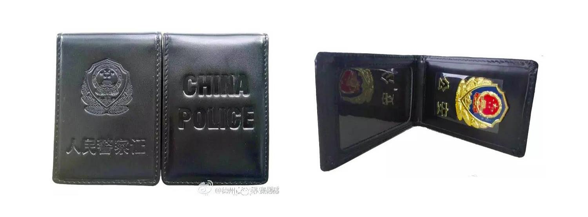

## 2.2.2 犯罪行为人的身份辨别

注：关于犯罪行为人假冒民警宣称“拘捕”受害人的情形应对：被可疑人员以接受警方调查或其他借口试图带离时，应第一时间辨认其身份，若认定为犯罪行为人，一旦感到被强行带离的威胁存在，应立即实施防卫。

辨认民警身份的方式如下：

1. 观察警服配备。

   警服必须有警衔、警号、胸徽、臂章 4 种警用标志。缺失任何一样都可认定其为假冒民警。
   
   胸徽印有省份名称，警号为 6 位阿拉伯数字。（如图 B-3）

   
   
   图 B-3。

2. 要求其出示证件。

   拒不出示的认定为假冒。人民警察证皮夹为竖式黑色皮质，外部正面压印警徽图案和“人民警察证”字样，背面压印“China Police”，整体立体突出，颜色鲜亮。向上翻开皮夹,内部上端镶嵌金属警徽一枚和“公安”二字，下端放置内卡。以上任何一个细节无法对应，都可确定为假冒证件。（如图 B-4）

   
   
   图 B-4。
