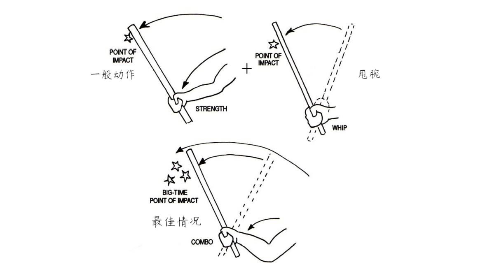

## 2.4.2 临时武器的应用

作为本文中主要的防卫方式，运用临时武器在达到防卫目的的过程中起着至关重要的作用。对于临时武器的分类和选择，在第一节中已做出了一定的解释。此处将对不同种类临时武器所针对的目标部位和相应的攻击方式作详细说明。

下文中对距离的表述有以下标准：身体正立，将手臂向正前方伸出，与地面平行，指尖向前。从指尖到身体的距离为踢击距离，从手腕到身体的距离为拳击距离，从手腕与手肘的中点到身体的距离为肘击距离。

1. 高温液体：
  
   A. 适用距离：
   
   无明确限制，保证泼出的精准度即可。通常小于 2.3~2.5 米。

   B. 体能要求：

   无。

   C. 最佳攻击目标：

   头部、面部、下体等神经密集的部位。也可选择如躯干等面积较大的目标。通常情况下全身各处都可作为目标。

   D. 使用方法：

   放在热水瓶或保温杯中，对准目标泼出。液体必须盛放在足够高的柱形容器中，否则泼出时极其容易使液体溅到手上。同时应当避免残余液体顺着杯口流下烫伤手掌。为保证精准度并减小被躲避的可能性，应从下方向前上方的侵害人头部位置泼出，从而增大覆盖面积。需要同时应对多个侵害人时，也可运用相应原理，将液体横扫泼出，达到同时攻击多人的效果。

   由于存在一定风险，需保证在极度紧张的情况下仍能熟练运用，在使用前多次进行练习和测试极为关键。以上方法仅供参考，练习时可尝试多种不同攻击方式，选择对于个人较为合适的方法。

2. 重物类：
   A. 握持：

   确保可在剧烈震荡下不致脱手，必要时可双手持械。

   B. 适用距离：

   拳击距离及以内。

   C. 体能要求：

   相对于本文中的其他器械要求较高且风险较大，力量在平均水平以下者慎用。

   D. 最佳攻击目标：

   头部、脸部、手背、脚背。

   E. 使用方法：

   向目标部位砸下，方向尽量由上向下。

3. 锐器类：

   A. 握持：

   以握拳的手势自然紧握，可选择正手（尖锐端指向前上方并从大拇指旁伸出，与持刀切割物品的握法相同）或反手（尖端向下，大拇指按住较钝的一端以防锐器滑出）。反手持械时可将锐器隐藏在对方视线之外。

   B. 适用距离：

   拳击距离及以内。

   C. 体能要求：

   无。

   D. 最佳攻击目标：

   （1） 双眼。将眼睛割出的可能性极小，建议一只手控制住对方头部或颈部后，直接向内捅入，最佳情况下可从眼眶刺入大脑。

   （2）颈部（主要包括前文分析的颈部要害部位，在持刀攻击时，整个颈部都可作为目标），颈动脉、气管和颈部后面处于颅骨下方的脊髓都是极其重要的目标。

   （3）腹部及躯干上无肋骨保护的部分。由于目标较大，较容易刺伤内脏，腹部是较为理想的目标。也可从胸骨正下方向上捅刺，在器械长度足够的情况下会刺穿肺部，并且可能造成呼吸困难。

   （4）腹股沟（裆部）。对于锐器而言是较为安全、理想的目标。由于位置较低，攻击极为方便，不易防范。

   （5）腿部。向大腿上捅刺可以有效地阻碍对方的正常行动。

   （6）前文中的腿筋在特殊情况下可作备用目标。

   E. 使用方法：

   锐器和刀具造成的使人失能的创伤通常都来源于穿刺伤而非一般的割伤或划伤。因此应选择向内捅刺，尽量加大刺入的深度，避免使用无法造成穿刺伤的砍和劈一类动作。同时由于这一点，不建议使用无法进行捅刺的菜刀。

   通常为避免刀具被夺下，应该在发动攻击之前将器械收在近身处或隐藏在身后（此处也可反手握持，但切不可为了起到威慑作用而在攻击前把刀伸向对方，以免刀具被夺）。
   
   攻击时务必连续快速捅刺，一方面可提高刺入要害部位的概率，另一方面可增加失血量。一般而言，目标不需要严格控制在上述范围内，而应依靠增加捅刺次数确保对关键部位造成创伤。
   
4. 棍棒类：

   A. 握持：

   单手或双手紧握（力量足够时用单手以增加灵活度，若体能较弱可用双手握持以增大力量），尽量握在棍棒下端（较适用于攻击）。

   B. 适用距离：

   根据具体情况而定。

   C. 体能要求：

   相对重物类而言要求稍低，但尽量慎用。

   D. 最佳攻击目标：

   （1）头部。在器械选择合理的前提下（质量足够大），攻击头部可使对方失去意识，重击后脑勺处可致人死亡。

   （2）咽喉。双手分别握在棍棒两端，向前上方迅速推出，剧烈撞击喉结和气管部位，可使喉结破碎，气管也有可能破裂。

   （3）颈部。同前文分析。

   （4）锁骨。同上文所述。

   （5）胫骨。同前文所述。

   （6）手背。同上文所述。

   E. 使用方法：

   攻击前切勿将棍棒向前直指以试图达到威慑效果，避免器械被夺。挥棍时动作不宜过大，尽量在保证力量的前提下加快速度，击打前不应做出过大的暗示性动作（如将棍棒后拉等）。挥动的过程中尽可能地握紧器械，避免手掌因震动而受伤。

   在挥棍的同时可向棍棒运动的方向甩腕，即使棍棒以手腕为中心向打击方向旋转，使动能增加（如图 B-5 所示）。最佳情况下应使尽量靠近棍棒前端的一段与目标接触，击中（或落空）后立刻收回并攻击下一目标，以防器械被夺。

   
   
   图 B-5。（图片取自 Pool Cues, Beer Bottles, and Baseball Bats - Marc MacYoung）

5. 粉末类：

   A. 适用距离：

   根据具体情况而定。可事先测试。

   B. 体能要求：

   无。

   C. 最佳攻击目标：

   双眼。

   D. 使用方法：

   大量粉末向对方面部快速泼出，尽量使覆盖面积最大化，确保其进入双眼。此时会对双眼造成强烈刺激，严重影响视觉。使用时注意风向，避免粉末被风倒吹。
