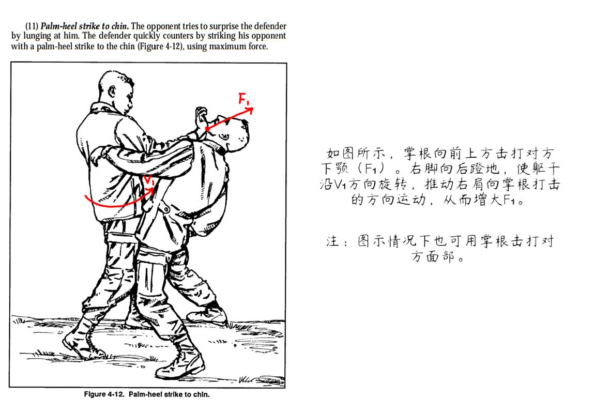
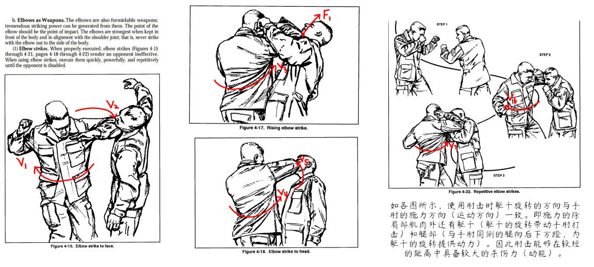
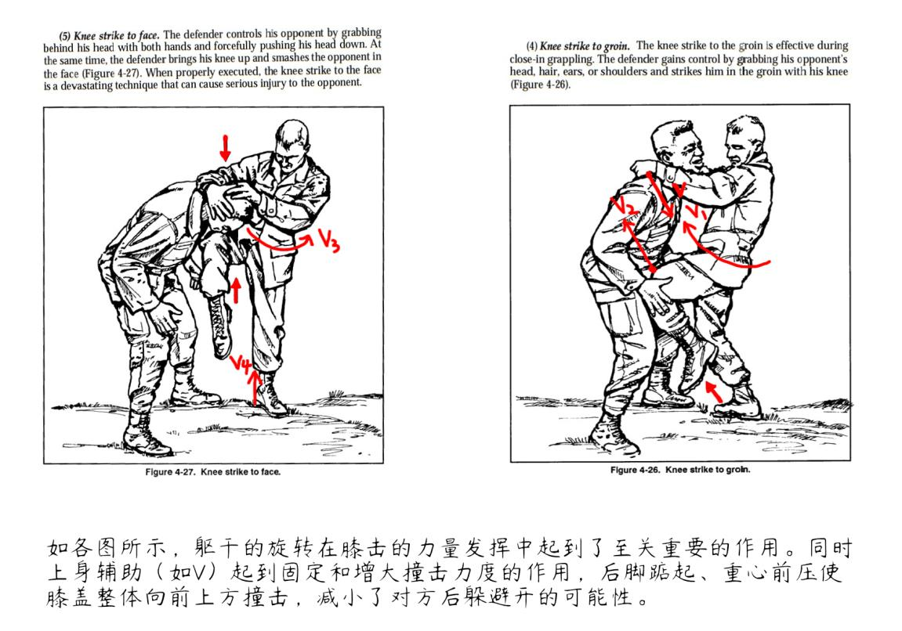
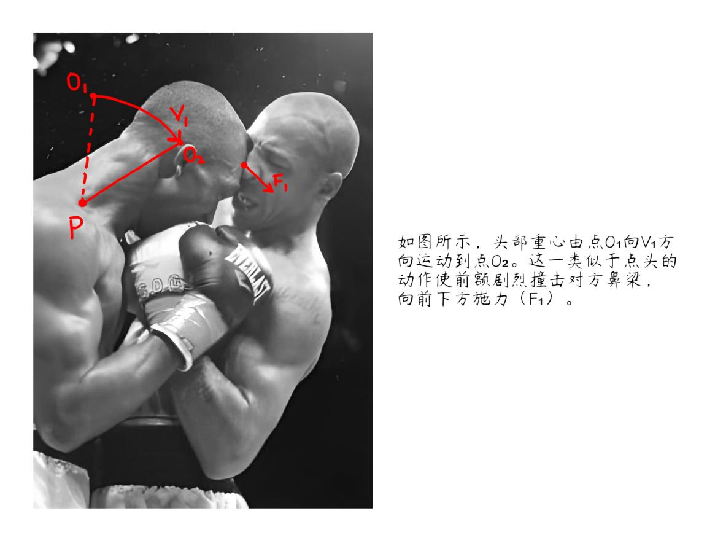
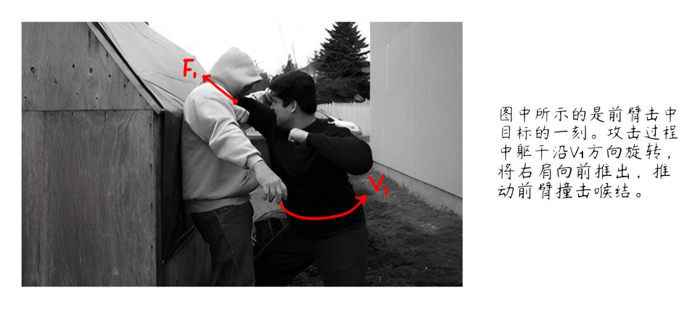

## 2.5.1 打击面分析及示例解读

在上文（三：战术及策略的核心原则和基本理念）中提到过，“所有创伤的造成都可以简单地分割为三个部分，即目标结构、打击面（即自身用于对侵害人造成创伤的生理结构或器械）和足够的动能。而造成创伤唯一的必要条件是合理选择或控制这三个部分，并不需要固定的技巧存在。” 此处先对打击面进行分析，并着重解析对使用者而言较为安全，对体能要求较低的一部分。

1. 掌根（即手掌底部）。

   在无限制（无保护措施）的情况下，出拳击打容易使指关节骨折或严重损伤，对于训练较少的人群来说手腕有在压力下扭伤的可能。针对这种问题，以掌根作为打击面是一种相对较安全的替代方式。举例如下（如图 B-6）：

   
   
   图 B-6。【图片取自 US Army FM 21-150 (Hand to Hand Combat) - Department of the Army】

   在上文中列举的要害部位中，较适用于掌根攻击的是鼻子（以及口鼻之间神经较密集的部分）、下颏和下颚侧面。在双方对面站立的情况下，对各目标的打击方式与上图类似，即由下向前上方打击（如击打鼻子时掌根落点在鼻子下方，向前上方击碎软骨或使其错位）。在一般条件下掌根适用的攻击距离在拳击距离和肘击距离之间。
   
   以掌根击打作为用拳攻击的替代方式，在一定程度上保留了拳击的某些特征，部分情况下近似等效。但应注意的是，在上图中的情形下（即两人对面站立，且均没有下蹲），由于手腕关节的生理极限，掌根不能攻击位于胸骨以下的部位，否则会使腕关节受到严重损伤（此时手指会比手腕先接触目标，掌根继续前压相当于强行弯折手腕使其超出自然延展的范围）。同理，攻击时应使手指自然放松向下弯曲，以避免指尖意外被对方手臂或其它部位勾住，绝对不可用手掌中部或手指代替掌根接触目标，否则也会造成以上结果。
   
2. 肘部。

   肘击最显著的特征在于能在近距离内产生较大的杀伤力（适用于肘击距离及以内），另一优势是肘尖接触面积小，压强大，容易对目标组织结构造成较难恢复的损伤。需要注意的是，肘击的杀伤力（动能）在很大程度上依赖于躯干旋转的力量（图 B-7 中详述）。实施攻击时，为了避免对方躲闪，可在肘击的同时用另一只手臂勾住对方的颈部，以限制其头部活动。在大多数情况下，也可用尺骨（前臂）靠近手肘的一端作为打击面，以增加命中率。

   一般情况下，肘击针对的目标包括但不限于下颚侧面、咽喉（气管）、面部、颈部侧面、颈部后方等。具体动作如图 B-7 所示：

   
   
   图 B-7。【图片取自 US Army FM 21-150 (Hand to Hand Combat) - Department of the Army】
   
3. 膝盖。

   以膝盖作为打击面从总体上来说有两种较容易执行的思路：在一般情况下撞击裆部（腹股沟）或在对方头部高度低于自身腰部时撞击头部与脸部。通常而言，后者会遭到较大力度的反抗，且容易造成使用者失去平衡，因而前者的成功率和适用范围均占优势。由于后者容易受到对方的阻力较大，只有在对方头部位置足够低时才能执行，否则风险和对防卫人的体能要求都会大幅增加。

   对于未经训练的人群，用膝盖撞击（简称膝击）只能在肘击距离内安全进行，距离过长极有可能使自身受到伤害。与上述打击面相同，膝击也需要核心力量的参与，包括躯干的转动，为撞击提供动能。但同时也需要双手辅助控制，将对方的身体向回拉并向撞击的膝盖处压下，从而增大造成创伤的概率。为增强穿透力（避免因对方向后躲闪而导致的膝击落空），通常应踮起后脚并使重心前压、向前上方进行撞击。如图 B-8 所示：

   
   
   图 B-8。【图片取自 US Army FM 21-150 (Hand to Hand Combat) - Department of the Army】
   
4. 前额。

   用前额进行攻击是极近距离下的一种特殊攻击方式，在街头格斗中最为常见，具有出其不意且难以防御的显著特点。主要方式是在控制对方头部位置的情况下，用前额剧烈撞击其口鼻部位（类似于大幅度点头的动作，此时前额应向前下方运动）。由于前额是人体中最坚固的结构之一，用前额撞击相对脆弱的口鼻，具有明显的结构优势（绝对不可撞击对方前额，否则容易受到脑损伤）。要格外注意的是此方式一般来说在对方头部静止或受到控制的时候才具有较高的成功率。示例如图 B-9：

   
   
   图 B-9。（图片取自 www.martialtribes.com）
   
5. 前臂。

   前臂（具体来讲是手腕上方 2~3 寸处）是专门针对喉结的打击面，可对气管造成严重的创伤。使用的方法是将手臂（肘关节）弯曲至最大限度，手掌向下，前臂与地面平行（此时肘关节向外），攻击时向前踏步（要求重心迅速大幅度前移以增大撞击力度），前臂向前迅速推出，撞击对方喉结（如图所示）。由于臂长的限制，这个动作只能在肘击距离内执行。前臂推出时为保证击中目标，也可在贴近锁骨处向前上方推（以免出现动作过高，无法击中的情况）。
   
   需要注意的是，以上动作的有效执行依赖于体重的运用（即重心的转移），要达到造成创伤所需的穿透力，攻击的过程中重心必须迅速向前移动一定的距离（可理解为近似于向前扑压的动作，区别在于此处需要同向前踏步以免重心失衡），移动的距离至少应使攻击结束时防卫人站在侵害人原来的位置上。

   与大多数攻击动作相同，在用前臂攻击时也需要依赖于躯干转动产生的力量，使其达到足以造成创伤的力度。如图 B-10 所示：

   
   
   图 B-10。（图片取自 The Little Black Book of Violence - Lawrence A. Kane, Kris Wilder, Lt. Col. John R. Finch, Marc MacYoung, Sgt. Rory Miller）
   
6. 其他（特殊方式）。

   此处提及的“其他”严格来说可以根据定义归类于“打击面”一类，但考虑到其对应的动作，在此将其归类为“特殊方式”。

   第一种是小关节操控。简而言之，取人体结构较脆弱的小关节（如手腕、指关节），并将其弯折至超出生理极限的程度（可简单理解为使关节错位或撕裂关节处的韧带，直观描述为“折断”）。对于未经训练的群体，不建议攻击手腕一类较粗且有肌肉环绕的关节。通常较安全可靠的目标是指关节。考虑到手掌的生理结构，将手指反向弯折较容易折断，必要时可一只手握住手掌以达到固定的作用，另一只手抓住手指并折断。动作应尽量迅速，以保证成功率。在不同情况中，也可相应选择向不同的方向将手指折断。

   除此之外，牙齿也是人体中一个极其重要的武器。在近距离内撕咬对方肌体是街头格斗中一种行之有效的手段，用力咬下后可向一定方向撕扯，尽量选择较突出的部位（如鼻子、手指、耳朵、喉结等）并在咬住后用力撕下。但这种方式的缺点在于容易导致使用者感染通过血液传播的疾病，因此应权衡利弊，理性选择。
   
7. 综合运用说明：

   在实际应用中，上述打击面所对应的攻击方式并不是固定的，而都只是能提供足够动能、从而造成创伤的工具。关键在于通过可靠的打击面，利用足够的动能对目标结构进行有效打击。因此打击面所能攻击的目标也没有限定范围，甚至是任意的，可根据需要灵活变化。最典型的例子是肘击，在条件允许的情况下几乎可以对任何目标（包括胃部、肝脏等）造成显著的创伤。
   
