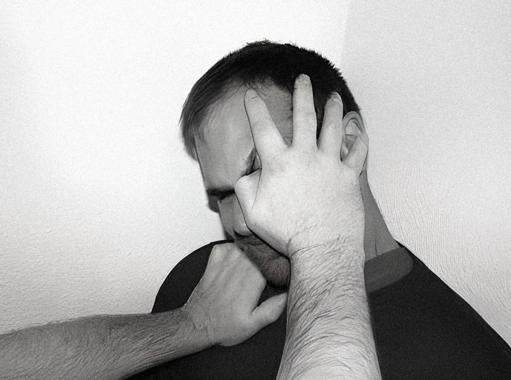

## 2.5.2 针对重点目标结构的攻击方式解析

对于人体上较为重要的攻击目标，相应的攻击方式存在一定拓展的空间，此处将其分别进行详细解析。

1. 双眼。

   在侵害人尚未出现戒备心理，还有先发制人的机会时，双眼是极其重要的攻击目标之一。对于双眼的袭击能高效地使对方失能，解除威胁。

   对双眼进行攻击时，如持有锐器，则首选方式是将对方头颅固定，用锐器捅入眼眶之中，最佳情况下应穿刺入大脑。而对于徒手攻击，则有较多不同的思路。在这里给出一种成功率较高，相对容易的方式：在固定对方头部的情况下（如用手臂勾住对方的颈部），用另一只手的四指搭住头颅侧面以辅助固定，拇指刺入眼睛与鼻梁相邻的一侧（深度尽量大），再用力向外侧挖出（如图 B-11 所示）。
   
   成功将眼珠挖出的可能性不大，但这个动作能有效地拉扯视神经，引发极强烈的疼痛、意识昏蒙和视力模糊。要注意的是通过挖眼使人失能比多数人想象的要困难，如果没有造成严重创伤的意图，那么使对方失能的概率会大大降低。另外由于人体双眼受到的攻击会引发剧烈的应激反应，必须将对方头部完全固定住以防其后仰躲避，进攻时对动作速度的要求也相应较高（从动作开始到接触到目标之间的时长大致控制在 0.25 秒及以内）。

   以双眼作为目标时，由于直接命中的概率较低，必须不断重复攻击才能确保造成创伤。在极度紧张的情况下，肾上腺素分泌导致身体执行精细动作的能力下降是较为常见的现象，因此对双眼这一类面积较小的目标的攻击容易失误。在缺乏训练的情况下，唯一的解决方法是迅速地重复攻击的动作，不断尝试直至成功为止。

   
   
   图 B-11。（图片取自 The Little Black Book of Violence - Lawrence A. Kane, Kris Wilder, Lt. Col. John R. Finch, Marc MacYoung, Sgt. Rory Miller）
   
2. 喉结（气管）。
   
   使用棍棒进行打击、通过小臂撞击致伤是两种较常见的攻击方式。其他攻击手段包括肘击等（对方侧面面向受害者时较合适）。所有相关攻击方式在上文中均有解释，此处仅做总结。
   
3. 腹股沟（裆部）。

   由于位置较低，对其进行的攻击较难被发现和格挡，在近距离内是一个极其理想的目标。

   如可使用临时武器，可用锐器捅刺或高温液体泼洒（目标为大致位置，且不分性别，因为其本质是对神经密集处的攻击）。

   对此目标进行踢击只有在对方双腿张开、正面面对自身的时候才有效，因此适用范围较小，通常成功的概率不大。如有上述可进行踢击的机会，务必注意控制距离，用小腿（胫骨）而非脚背接触目标。在肘击距离内，也可通过膝盖撞击的方式致伤。

   进行徒手攻击对于男性作用较大。由于周围组织较柔软，可握拳由下向上攻击。除此之外，在条件允许的情况下，可用力抓握并向外撕扯。
   
