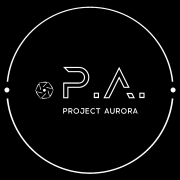

## 注解及声明

《针对戒网瘾学校非法绑架未成年人的逃生方法解析》为暮光计划（Project Aurora）版权所有。本网站由PDF原版转换生成，未对其内容作任何修改。书中内容不代表镜像站搭建者立场。

暮光计划 P. A. 项目网址：[https://proj3ctaurora.tilda.ws](https://proj3ctaurora.tilda.ws)

 

------

 

Tips:

> 至今一切社会的历史都是阶级斗争的历史。
> 
> ——马克思&恩格斯《共产党宣言》

> 阶级斗争，无论在政治上或思想上，都必须进行到底。
> 
> ——列宁

> 随着我们向社会主义前进，阶级斗争不会熄灭，而是会更加激烈。
> 
> ——斯大林

> 社会主义革命胜利了，资本主义还会存在，阶级斗争还要进行。
> 
> ——毛泽东
